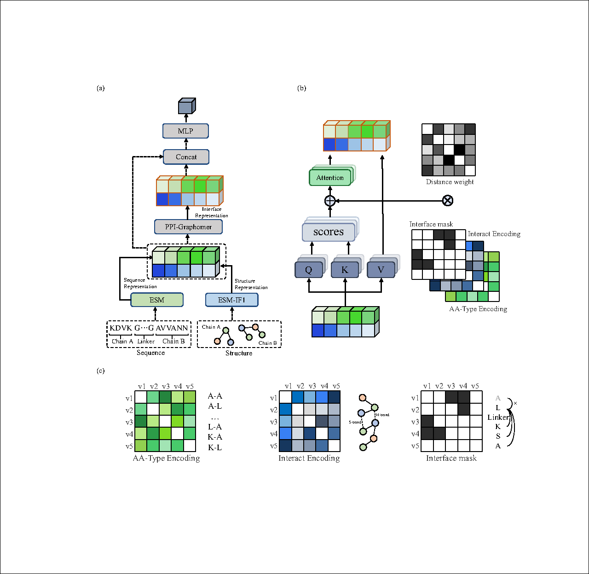

# PPI-Graphomer: Enhanced Protein-Protein Affinity Prediction Using Pretrained and Graph Transformer Models

## Overview
Protein-protein interactions (PPIs) are fundamental to understanding biological processes and have significant implications in drug research and development. The PPI-Graphomer project seeks to improve the prediction of protein binding affinities by integrating pretrained features from large-scale language models and inverse folding models, particularly focusing on the molecular interaction information at binding interfaces.

Our model, PPI-Graphomer, has been shown to outperform existing state-of-the-art methods on multiple benchmark datasets, demonstrating excellent generalization capabilities.

## Features
- Integrates pretrained features from ESM2 and ESM-IF1 models.
- Utilizes advanced graph-based edge definitions to enhance interface characterization.
- Employs the novel PPI-Graphomer module for modeling protein binding interactions.
## model architecture


## Performance
The model has achieved superior performance metrics:
- **5-fold Cross-Validation**: PCC of 0.581, MAE of 1.63.
- **Benchmark Comparison**: Achieved top rankings with a combined test set PCC of 0.633 and MAE of 1.57.

## Installation

Before you begin, ensure you have met the following requirements:
- Dependencies listed in `requirements.txt`

```bash
git clone https://github.com/yourusername/ppi-graphomer.git
cd ppi-graphomer
pip install -r requirements.txt
```
## Usage
We provide two methods to run the script, single pdb or batch.

To predict single pdb, use the provided command-line interface:

```bash
python inference.py --pdb [path_to_pdb]
```
If you need to make batch predictions, you should follow these steps:

```bash
python preprocess_cpu.py --workers [cpu numbers] --save_dir [path_to_PreprocessedCpuData] --pdb_folder [path_to_pdbs]
python preprocess_gpu.py --workers [cpu numbers] --save_dir [path_to_PreprocessedGpuData] --pdb_folder [path_to_pdbs]
python data_check.py  --cpu_path [path_to_PreprocessedCpuData] -gpu_path [path_to_PreprocessedGpuData] --save_folder [path_to_CheckedData]
python generate_batch.py  --data [path_to_CheckedData] -gpu_path [path_to_PreprocessedGpuData] --batch_path [path_to_BatchData]
python evaluate.py  --batch_path [path_to_BatchData]
```
We have divided the whole step into several items in order to speed up the process by separating the esm large model prediction process from the affinity prediction process.

